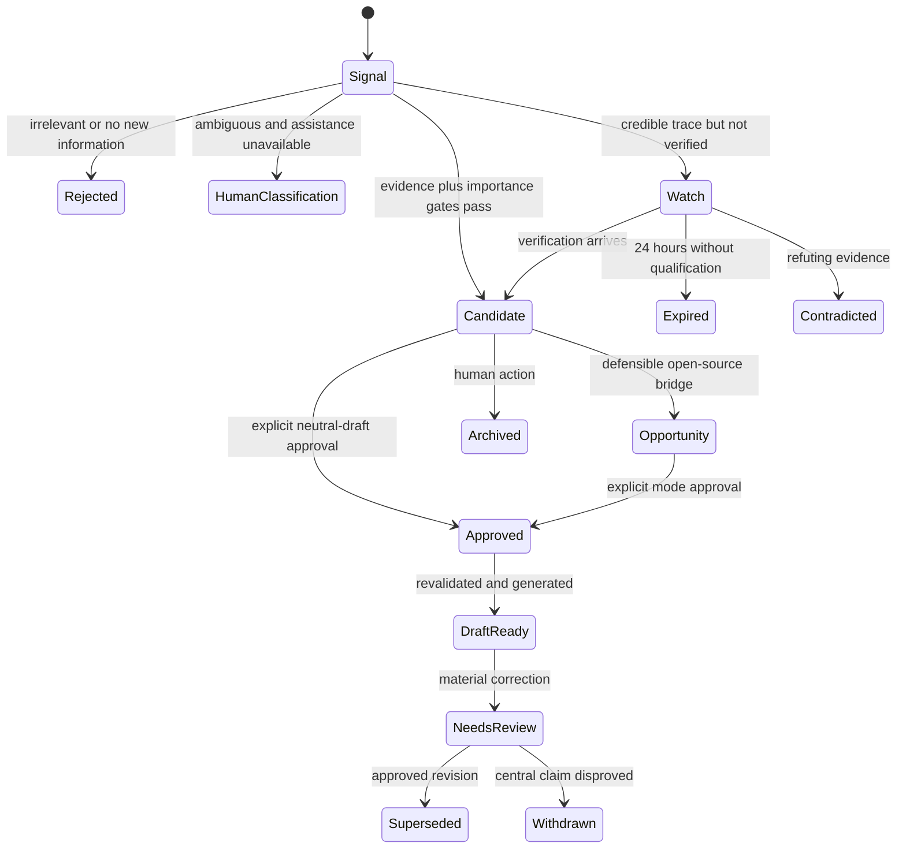

# Open Source AI News Wire — V1 Implementation Plan

Status: dashboard milestone implemented and verified; broader monitoring phases remain planned

Planning date: 2026-07-14

Target environment: one local macOS user account

Canonical terminology: `CONTEXT.md`

## 1. Outcome

Build a local-first AI news-monitoring system that:

- checks free public sources every 30 minutes while the Mac is awake;
- catches up automatically after sleep, shutdown, logout, or loss of connectivity;
- covers open-ecosystem AI, broader AI, and AGI developments;
- verifies and clusters evidence before promoting a signal;
- alerts the operator to fresh, consequential candidates and credible watch signals;
- uses ChatGPT only when deterministic processing finds semantic work worth doing;
- requires explicit human approval before every draft;
- writes neutral news by default and adds a clearly separated pro-open-source lens only when explicitly approved;
- stores the runtime corpus only on the Mac, with no product backup or synchronization feature in V1; and
- exposes review and control through a secured, on-demand local web interface.

V1 is a viability pilot. It is not a hosted service, a publishing system, a general web crawler, or a claim of complete AI-news coverage.

## 2. Locked constraints

| Area | V1 decision |
|---|---|
| Repository | Private independent repository: `SyedShad/open-source-ai-news-wire` |
| Upstream | Preserve history and license attribution; keep the public upstream as a read-only remote |
| Runtime | 100% local storage and orchestration on the Mac |
| Remote processing | Selected minimal packets may be sent to ChatGPT through the authenticated Codex CLI |
| External spend | $0 incremental pay-as-you-go spend; no API or paid fallback |
| ChatGPT plan | Existing Pro plan; background work targets at most 20% of shared agentic usage; drafting is tracked separately |
| Schedule | Minute 00 and 30 of every hour, plus load/login recovery |
| Power behavior | Same behavior on battery and Low Power Mode; never keep the Mac awake or change power settings |
| Catch-up | Automatic maximum 72 hours; optional human-triggered extended catch-up for older gaps |
| Drafting | Human confirmation required before all first drafts and revisions |
| Editorial posture | Neutral by default; open-source lens only for an approved, defensible opportunity |
| Publishing | No automatic publishing or destination integration |
| Interface | Local, loopback-only, server-rendered web app; no cloud UI |
| Storage | SQLite plus content-addressed files under `~/open-source-ai-news-wire-data/` |
| Retention | No automatic age-based deletion; explicit purge only |
| Backup | No backup, restore, snapshot, synchronization, or backup-detection feature |
| Updates | Manual, versioned, atomic application releases; no automatic pull, merge, or install |

The 20% background-usage target is a best-effort operational constraint, not an exact token guarantee. ChatGPT exposes plan usage and limits, but task consumption varies with model, context, and complexity. V1 therefore combines a conservative local effort budget, observed usage checks during the pilot, and automatic deferral when the budget is exhausted.

## 3. System boundary

### In scope

- Source registry and free public source adapters.
- Incremental collection, source cursors, retry, catch-up, and health monitoring.
- Normalization, fingerprinting, story clustering, freshness, and momentum.
- Evidence mapping, verification gates, importance qualification, and scoring.
- Watch notices, candidate alerts, correction alerts, and catch-up summaries.
- Conditional ChatGPT classification, synthesis, translation, and approved drafting.
- Local review interface, native macOS notifications, exports, and purge controls.
- Local installation, LaunchAgent management, diagnostics, schema migrations, and validation.
- A destination-neutral reusable skill that explains the workflow to compatible agent hosts.

### Out of scope

- Running while the Mac is asleep, shut down, logged out, or offline.
- Preventing sleep, waking the Mac, or modifying battery and power policy.
- Paid search, OpenAI API usage, purchased credits, or automatic cost-bearing fallback.
- Browser-cookie reuse, authenticated feeds, paywall bypass, credentialed scraping, or arbitrary proxies.
- Model weights, dataset, installer, or release-asset downloads.
- Automatic publication, accounts, multi-user collaboration, mobile access, or LAN access.
- Cloud database, hosted worker, remote telemetry, automatic backups, or disaster recovery.
- Automatic learning from feedback or automatic changes to tracked source definitions and scoring rules.
- Guaranteed exhaustive coverage of every AI development.

## 4. Architecture

```mermaid
flowchart LR
    A["macOS LaunchAgent\n00 and 30 minutes"] --> B["Single-instance runner"]
    B --> C["Deterministic scout"]
    C --> D["Free public source adapters"]
    D --> E["Normalize and fingerprint"]
    E --> F["SQLite and content store"]
    E --> G["Cluster and evidence engine"]
    G --> H{"Semantic work needed?"}
    H -- "No" --> I["Qualification and priority"]
    H -- "Yes and budget available" --> J["Minimal processing packet"]
    J --> K["Isolated Codex invocation"]
    K --> L["Schema and evidence validator"]
    L --> I
    H -- "Budget unavailable" --> M["Deferred or human classification"]
    I --> N["Review inbox and macOS notices"]
    N --> O["Human review"]
    O --> P{"Draft approved?"}
    P -- "No" --> Q["Archive, research, or wait"]
    P -- "Yes" --> R["Pre-draft revalidation"]
    R --> S["Approved ChatGPT draft task"]
    S --> T["Versioned draft and exports"]
```



The scheduler, worker, database, and notification path do not depend on the web interface being open. The interface starts only for a review session and communicates with the same local database and durable action queue.

## 5. Repository and installed layout

### Source repository

The new application lives beside preserved upstream code until selectively reused components have been audited. The inherited monolith is not the V1 application boundary.

```text
open-source-ai-news-wire/
├── .github/
│   └── workflows/                 # offline validation and security only
├── config/
│   ├── defaults/                  # safe portable defaults
│   ├── policies/                  # scoring, evidence, usage, and retention rules
│   └── sources/                   # canonical public source registry
├── docs/
│   ├── architecture/
│   ├── operations/
│   ├── privacy-security/
│   └── plans/
├── schemas/
│   ├── database/
│   ├── packets/
│   ├── model-output/
│   └── exports/
├── skills/
│   └── open-source-ai-news-wire/
│       ├── SKILL.md
│       └── references/
├── src/
│   └── open_source_ai_news_wire/
│       ├── cli/
│       ├── collector/
│       │   └── adapters/
│       ├── domain/
│       ├── evidence/
│       ├── clustering/
│       ├── scoring/
│       ├── assistance/
│       ├── drafting/
│       ├── notifications/
│       ├── scheduler/
│       ├── storage/
│       ├── security/
│       ├── web/
│       │   ├── templates/
│       │   └── static/
│       └── operations/
├── tests/
│   ├── fixtures/
│   ├── unit/
│   ├── integration/
│   ├── security/
│   └── macos/
├── CONTEXT.md
├── IMPLEMENTATION_PLAN.md
├── LICENSE
└── pyproject.toml
```

Before implementation, update repository-level agent instructions, manifests, packaging metadata, coverage paths, and documentation so they describe the new application without weakening inherited security or coverage gates.

### Installed application

```text
~/.local/share/open-source-ai-news-wire/
├── app/
│   ├── releases/
│   │   └── <version>/             # immutable code plus locked environment
│   ├── current -> releases/<version>
│   └── runtime/                   # pinned Python 3.12 runtime
└── install-state.json

~/.local/bin/
└── open-source-ai-news-wire       # stable launcher

~/Library/LaunchAgents/
└── ai.open-source-news-wire.plist
```

The launcher resolves `current`, validates the release and runtime-data boundaries, then executes the requested command. Installation and upgrades stage a complete release, validate it, atomically switch `current`, and retain the immediately previous application release for code rollback. This release rollback is not a runtime-data backup.

### Local runtime corpus

```text
~/open-source-ai-news-wire-data/
├── database/
│   └── news-wire.sqlite3
├── content/
│   ├── evidence/
│   ├── primary-snapshots/
│   └── translations/
├── editorial/
│   ├── drafts/
│   ├── evidence-bundles/
│   └── exports/
├── operations/
│   ├── locks/
│   ├── queue/
│   ├── logs/
│   └── reports/
├── config/
│   ├── local-settings.toml
│   └── source-overrides.toml
└── tmp/
```

Generated artifact names use:

```text
<utc-time>--<artifact-type>--<story-id>--<short-slug>--v<version>.<ext>
```

The database stores the canonical relationships. Files are category-first, content-addressed where appropriate, and referenced rather than duplicated across organizations, people, topics, or coverage lanes.

## 6. Technology selection

- Python 3.12, provisioned and pinned for the installed application.
- A locked virtual environment per application release.
- SQLite in WAL mode, foreign keys enabled, explicit migrations, and short write transactions.
- Flask and Jinja for server-rendered pages.
- Small bundled vanilla JavaScript modules for polling, confirmation dialogs, and editor actions; no Node.js toolchain, SPA framework, CDN, or remote asset.
- A bounded HTTP client with redirect, DNS, scheme, size, timeout, and host controls.
- Typed domain objects and versioned JSON Schemas for processing packets, model results, and exports.
- macOS LaunchAgent for per-user scheduling and native notification commands or APIs for alerts.
- Codex CLI authenticated by the user's ChatGPT account; no API key.

The Mac's current `python3` is 3.10.10, while the project requires 3.12 or newer. A bundled Codex Python 3.12.13 exists and can help development, but it belongs to another application and is not a stable production dependency. The installer should provision a free, pinned Python 3.12 runtime—preferably through a checksum-verified managed distribution—and build the locked environment from that runtime. Downloading it requires explicit authorization during implementation.

## 7. Domain model and durable state

Core tables or aggregates:

| Aggregate | Purpose |
|---|---|
| `source_registry` | Tracked source definition, family, role capabilities, rate policy, parser version |
| `source_state` | Local enabled state, cursor, ETag, Last-Modified, failure streak, health |
| `scan_run` | Trigger, interval, result, timing, degraded/offline state, counters |
| `source_transaction` | Independent attempt and cursor commit for one source |
| `raw_observation` | Minimal transport metadata and fingerprint; not an unbounded archive |
| `source_item` | Normalized title, URL, public time, language, source role, extracted facts |
| `story_cluster` | Stable story identity, earliest public time, lane, openness class, lifecycle |
| `story_membership` | Source-item relationship, derivation/citation-chain relationship, language |
| `claim` | Atomic material claim with status and volatility |
| `evidence_link` | Claim-to-source mapping, support/contradict/attribute role, passages |
| `watch_notice` | Watch reason, trace, review cadence, expiry, outcome |
| `candidate` | Evidence gate, importance gate, priority score and explanation |
| `content_opportunity` | Relevance bridge, opportunity strength, counterargument |
| `alert` | Candidate, watch, correction, health, recovery, or catch-up notice |
| `review_action` | Human action, reason, time, approval snapshot, pending state |
| `draft` | Mode, status, version, prompt/model provenance, source snapshot |
| `work_item` | Durable enrichment, translation, validation, drafting, or recovery queue entry |
| `usage_ledger` | Background/draft category, effort units, model, input/output size, result |
| `diagnostic_event` | Redacted operational event |
| `purge_plan` | Preview, selected categories, expected effects, confirmation record |

### Lifecycle



Viewing a record is never approval. Approval stores the selected draft mode and a snapshot of relevant claims, evidence, timestamps, and source availability. A material update invalidates that snapshot and requires a new decision.

## 8. Source strategy

No aggregator is treated as complete or authoritative. V1 uses a layered registry and records the role each item actually plays.

### Source families

| Family | Examples of free public surfaces | Default role |
|---|---|---|
| Official AI organizations | Newsrooms, research pages, release notes, system cards, policy posts | Event |
| Open development ecosystems | GitHub releases and advisories, package releases, public model and dataset hubs | Event/discovery |
| Research | arXiv, lab publications, conference programs, proceedings, evaluation and benchmark sites | Event |
| Government and law | Regulator announcements, consultations, legislation, standards bodies, court and public records | Event |
| Corporate and financial | Official investor relations, public filings, acquisition and partnership announcements | Event |
| Safety and security | Vendor advisories, public incident reports, vulnerability databases, research disclosures | Event/reporting |
| Independent reporting | Specialist technology, science, policy, business, and security publications with public feeds/pages | Reporting/discovery |
| Aggregation | HuggingNews, Hacker News, general news and research aggregators | Discovery |
| Public social signals | Public feeds from organizations and credible reporters where access requires no account or cookies | Discovery/reporting |
| Newsletters | Public web archives or feeds only; no mailbox access in V1 | Discovery/reporting |

The implementation phase creates the exact starter registry only after checking current URLs, update frequency, terms, robots guidance where applicable, rate limits, and parser stability. Disabled definitions may remain available, but V1 does not enable sources requiring accounts, cookies, paywall circumvention, credential-bearing URLs, paid access, or personal sessions.

### Adapter contract

Every adapter declares:

- stable source ID, family, owner, base hosts, and allowed redirects;
- supported fetch type: RSS, Atom, JSON API, HTML listing, sitemap, or release feed;
- default monitoring role and the conditions under which an item has another role;
- cursor type, conditional-request support, pagination cap, and catch-up support;
- parser version, timestamp semantics, canonical-URL rules, and language metadata;
- published rate guidance, request timeout, maximum response size, and backoff policy;
- health probe, non-retryable error taxonomy, and fixture provenance;
- whether a fuller snapshot may be retained under the evidence policy.

Canonical definitions are tracked. Local enable/disable settings and machine-specific overrides are untracked. A proposed permanent registry change is visible in the interface and enters source control only after explicit human approval.

### Multilingual coverage

- Start from high-value original-language sources rather than a fixed language allowlist.
- Preserve source language, original passage, URL, and timestamp.
- Use deterministic metadata and feed structure first.
- Translate only short passages needed for classification or drafting.
- Label machine translation and retain its provenance.
- Require an official translation or an additional independent confirmation for sensitive legal or technical translated claims.
- Produce English drafts in V1.

## 9. Collection, recovery, and health

### Normal scheduled run

1. Acquire the single-instance lock; coalesce an overlapping trigger into one pending follow-up.
2. Validate release, runtime root, schema, storage space, and network state.
3. Compute source intervals from committed per-source cursors.
4. Run the scout first, using conditional HTTP requests and a maximum of four simultaneous network requests, one active request per host, and published backoff rules.
5. For each source, normalize and persist within its own transaction, then advance only that source's cursor.
6. Queue new or materially changed signals for deterministic qualification and bounded enrichment.
7. Invoke ChatGPT only when a queued task passes need, privacy, and budget gates.
8. Commit completed work, record degraded coverage, emit eligible notices, and release the lock before the 25-minute hard budget.

Unfinished enrichment stays in a durable idempotent queue. Scout work always precedes backlog work. Repeated backlog growth sets a visible timeliness-degradation state.

### Sleep, shutdown, logout, and restart

- A per-user LaunchAgent runs at minute 00 and 30 and at load/login.
- A locked screen does not end the logged-in awake session, so scans may continue.
- System sleep, shutdown, or logout pauses work. The product does not prevent or alter these states.
- On the next launch, the runner calculates the real gap from source cursors and starts one coalesced recovery run rather than replaying every missed trigger.
- Automatic catch-up covers at most the previous 72 hours.
- The operator can request an extended catch-up with explicit start/end dates for older intervals.
- Recovered items retain their original First-Public Time and therefore never become artificially fresh.

### Connectivity loss

A confirmed whole-Mac offline run advances no cursors and does not increment every source's failure streak. Connectivity recovery creates one recovery-and-catch-up notice. An individual host failure while other hosts work normally still affects that source's health.

### Source health

- Normal source alert: three consecutive scheduled failures.
- Immediate alert: parser or configuration error, authentication unexpectedly required, non-retryable response, unsafe redirect, or complete loss of a source family.
- Recovery: one notice stating whether its catch-up completed or a gap remains.
- Partial failure: successful source transactions remain committed; failed source cursors do not advance.

### Watch cadence

A watch notice lasts 24 hours unless promoted, contradicted, or manually closed. Recheck every 30 minutes for the first 6 hours, then every 2 hours until expiry. Only a material update produces another content notice.

## 10. Qualification, verification, and ranking

### Processing order

1. Confirm AI relevance.
2. Assign at least one coverage lane: Open Ecosystem News, AGI Development, or Open-Source Lens Opportunity candidate.
3. Determine openness class without conflating open source, open-weight, source-available, and proprietary systems.
4. Canonicalize URLs and cluster the underlying development across languages, reposts, and citation chains.
5. Establish First-Public Time and freshness: Breaking 0–2 hours, Fresh over 2–6 hours, Catch-Up over 6 hours.
6. Build atomic claims and evidence relationships.
7. Apply evidence gate: one identifiable primary source, or two genuinely independent confirmations when a primary source is unavailable.
8. Apply importance gate: correct lane, meaningfully new information, and plausible material effect.
9. Score candidate priority only after both gates pass.
10. Separately assess whether a defensible open-source relevance bridge exists.

An official announcement proves that the organization made the announcement. It does not independently prove performance, comparative, safety, or impact claims inside it. Those claims stay attributed until supported by suitable evidence.

### Priority score

| Component | Maximum |
|---|---:|
| Material impact | 40 |
| Time sensitivity | 20 |
| Freshness | 15 |
| Novelty | 10 |
| Source significance | 10 |
| Momentum | 5 |
| Total | 100 |

- Urgent: at least 80, plus high impact and immediate relevance.
- High: 60–79.
- Standard: below 60.
- A human override requires a durable reason.

Momentum can reorder attention but never establishes truth, evidence, or importance. A zero-engagement official release can qualify immediately.

### Open-source opportunity

Assess separately as Strong, Moderate, or Weak across:

- specificity of the open-source relevance bridge;
- quality of evidence;
- usefulness of the analysis;
- timing headroom; and
- quality of the limitation or counterargument.

Strong and Moderate may become Content Opportunities. Weak stays eligible only for neutral treatment. The lens must identify a concrete mechanism—such as transparency, auditability, governance, access, or distributed control—and cannot rest on generic advocacy.

### Watch threshold

A watch notice requires a credible trace, high potential impact, and a plausible near-term confirmation path. Popularity alone is insufficient. Unverified watch items are visibly labelled, cannot be drafted, and never receive a normal candidate alert.

### Pre-draft revalidation

Immediately before drafting, refetch or recheck volatile primary facts, corrections, source availability, and the current cluster. A material change cancels the approval snapshot. A mere passage of time updates the freshness label but does not automatically cancel approval.

## 11. ChatGPT assistance and usage control

### Permitted tasks

- Classify genuinely ambiguous lane or openness questions.
- Compare borderline clusters using only supplied metadata and passages.
- Summarize supported claims and counterarguments.
- Translate short relevant passages with provenance.
- Assess opportunity strength from an evidence packet.
- Create or revise a draft after explicit approval.

ChatGPT is never evidence, a source, a verifier of its own claims, or a substitute for retrieving a primary artifact.

### Minimal processing packet

Each task contains only:

- operation and schema version;
- task-specific source titles, public URLs, dates, languages, and assigned roles;
- short relevant passages, not unrelated or complete archives;
- extracted claims and evidence links;
- necessary story metadata and human guidance; and
- prompt-policy version.

It excludes the runtime database, full corpus, credentials, cookies, logs, unrelated drafts, local usernames, and machine-specific paths.

### Invocation boundary

The worker creates a fresh isolated directory containing only the packet and output schema, invokes Codex non-interactively through standard input, accepts no approvals or tools, and validates one schema result. The intended command shape is:

```text
codex exec --ephemeral --ignore-user-config --sandbox read-only \
  -c approval_policy="never" --output-schema <schema> --json -
```

Read-only mode alone may not prove that unrelated readable files are invisible. Before scheduled assistance is enabled, implementation must run an adversarial canary test showing that the process cannot read the repository, runtime root, home-directory test secrets, or private network resources. Use a restricted outer macOS execution profile or equivalent isolation around the temporary task directory if required.

This is a hard gate: if packet-only filesystem and network access cannot be demonstrated, scheduled ChatGPT assistance remains disabled. The deterministic scout continues and items become deferred or Human Classification Needed. V1 must not solve this by granting broader access, using an API key, or enabling a paid service.

Ephemeral CLI execution is a local-state control, not a promise that OpenAI retains nothing. The interface must explain that selected packets go to OpenAI and that account-level data controls govern remote retention and model-improvement settings.

### Result validation

- Validate JSON/schema shape and operation version.
- Reject unknown fields, oversized output, unsafe markup, or tool/action instructions.
- Require every material factual statement to cite supplied claim/evidence IDs.
- Prohibit new URLs or unsupported facts from silently entering evidence.
- Record actual model, prompt/schema versions, observed sizes, result, and retry.
- Allow one retry for transient or malformed output; otherwise queue and surface the failure.

### Pro-plan background budget

Initial local proxy for a rolling 24-hour window:

| Work | Effort units |
|---|---:|
| Low-reasoning routine triage | 1 |
| Medium-reasoning cluster or candidate synthesis | 2 |
| High reasoning, only after explicit human request | 4 |

- Routine background allowance: 8 units.
- Urgent reserve: 2 additional units, usable only for urgent or watch-confirmation work.
- Human-approved drafting and revisions: excluded from the background allowance and reported separately.
- One ChatGPT task at a time.
- Prefer batching related claims from one story into one bounded task.
- Never invoke ChatGPT for an empty or unchanged scan.
- When allowance is exhausted, preserve work for the next window and show the deferral.
- Never purchase or consume add-on credits automatically.

The unit allowance is deliberately conservative but does not itself prove 20%. During the 72-hour shadow run, compare the local ledger with the Codex Usage panel before and after controlled tasks. If observed usage approaches the user's 20% ceiling, lower the unit cap or task complexity before notifications are enabled. If the interface cannot expose a reliable numerical percentage, label the result as a calibrated estimate rather than exact consumption.

Use the supported account-default Codex model and record the actual model. Use low reasoning for routine triage, medium for synthesis and normal drafting, and high only after an explicit request.

## 12. Drafting and editorial controls

### Approval flow

1. Human opens a verified candidate.
2. Human may accept, edit facts/notes, request more research, archive, or approve drafting.
3. Draft approval explicitly selects a mode.
4. The system stores the approval snapshot and revalidates it.
5. State moves `Pending` → `Generating` → `Draft Ready`, or to a visible failure/deferred state.
6. Revisions create new versions and require explicit revision approval when responding to a correction.

### Draft modes

`Neutral News Brief` is the default for any approved candidate:

- factual headline;
- compact metadata;
- concise factual brief;
- what is known versus attributed or uncertain;
- why it matters, stated without advocacy; and
- grouped sources.

`Open-Source Lens Brief` is available only when the candidate is an approved Strong or Moderate Content Opportunity:

- the same neutral factual section first;
- a separately labelled Open-Source Lens section;
- a specific evidence-backed mechanism by which openness could change the outcome; and
- a meaningful limitation, tradeoff, or counterargument.

The writing pattern is inspired by HuggingNews: compact, scannable, evidence-forward, and consistent across briefs. The implementation should learn structural characteristics, not copy site text or branding.

### Corrections and versions

- Never silently overwrite a draft.
- A material correction identifies affected claims and marks the draft `Needs Review`, `Withdrawn`, or later `Superseded`.
- Every version preserves prompt/model provenance, evidence snapshot, human guidance, and status history.
- Feedback and dismissal/revision reasons may generate calibration suggestions, but no rule changes automatically.

### Output boundary

No publishing credential or destination configuration exists in V1. Human-initiated outputs are:

- Copy to Clipboard;
- one Markdown brief;
- one self-contained sanitized HTML brief; or
- one JSON evidence bundle.

## 13. Local web interface

### Pages

1. **Overview** — current coverage, urgent/high items, queue lag, health, last and next scan.
2. **Review Inbox** — filters for watch, candidate, correction, catch-up, health, and status.
3. **Story and Evidence** — cluster timeline, claims, source roles, citation chains, translations, scores.
4. **Draft Editor and History** — approval, generation state, version comparison, correction status, export.
5. **Sources and Health** — family coverage, cursors, lag, failures, recovery, local enable/disable.
6. **Schedule and Usage** — install/pause/resume/run now, trigger state, background effort ledger, draft usage.
7. **Settings and Data** — runtime root, retention explanation, purge preview, diagnostics export, app version.

### Security and lifecycle

- Bind only to a random loopback port; never `0.0.0.0` and never LAN interfaces.
- Generate a one-time launch token and set a same-site, HTTP-only session cookie.
- Require CSRF tokens on all state changes and confirmation for destructive actions.
- Apply a restrictive Content Security Policy, no remote scripts/styles/fonts, escaped templates, sanitized rendered HTML, and safe download headers.
- Defend against DNS rebinding and validate `Host`/`Origin` headers.
- Do not fetch arbitrary URLs submitted through the interface.
- Start on demand, open the default browser, and provide a visible Stop action.
- Stop after 30 minutes without a browser heartbeat; scheduled monitoring continues.
- Use polling for status updates and a durable action queue for changes during active scans.
- Support keyboard navigation, readable status labels, and avoid color-only meaning.

There are no accounts in V1 because the interface is single-operator and loopback-only.

## 14. Notifications

- Native macOS notification for urgent and high candidates, watch notices, corrections, source-family outages, and critical operational states.
- Standard candidates remain in the Review Inbox by default.
- Catch-up produces a grouped summary rather than one desktop alert per recovered item.
- Coalesce bursts greater than five eligible notices in ten minutes into one summary while keeping individual inbox records.
- Repeat only for a material update, not a new repost or engagement increase.
- Clicking a notification starts or reuses a local review session and opens the relevant record.

## 15. Storage, retention, purge, and migrations

### Retention

- Keep structured metadata, fingerprints, short normalized evidence passages, decisions, drafts, and audit relationships until explicit purge.
- Keep fuller snapshots only for permissively licensed primary material, active watches, candidates, or explicit Keep actions.
- Do not keep raw feed transport or full journalism articles by default.
- Do not delete by age automatically.

### Purge

1. Generate a non-destructive preview grouped by category.
2. Estimate reclaimed space and list consequences for evidence, drafts, or audit history.
3. Require explicit category selection; select nothing by default.
4. Require a second deliberate selection for drafts, decisions, evidence maps, and ledgers.
5. Record confirmation, delete only selected content, remove orphaned references transactionally, and report results.

Purge is deletion, not backup rotation. There is no undo or recovery promise.

### Storage pressure

- Warn below 10 GB free.
- Below 2 GB, stop fetching, enrichment, drafting, and substantive database writes.
- Keep the UI and diagnostics available in a read-mostly critical state.
- Never auto-delete data to recover space.

### Migrations

- Explicit update command only; never migrate during a scan or interface startup.
- Additive, forward-only, transactional, and non-destructive during the pilot.
- Failed migration leaves the current schema unchanged.
- Older code refuses a newer schema.
- A code rollback is allowed only when compatible with the current schema.

## 16. Security and privacy

### Local controls

- Default directory mode `0700`; sensitive files `0600`.
- Credentials, if any are later needed for an explicitly enabled source, live in macOS Keychain, never configuration files.
- No application-level database encryption in V1; FileVault is an operator/OS decision outside product scope.
- Runtime-root validation refuses any Git worktree and warns about recognized cloud-sync folders.
- Ignore rules, staged-file scanning, secret scanning, and CI checks reinforce the boundary.

### Network controls

- Allow only registered public source hosts and OpenAI for authorized assistance.
- Resolve and reject loopback, link-local, private, multicast, and other non-public addresses before connection and after redirects.
- Allow `https` by default; narrowly approved `http` sources require an explicit registry exception.
- Reject embedded credentials, non-web schemes, suspicious redirects, arbitrary proxy environment variables, browser cookies, and personal session data.
- Enforce timeouts, response-size limits, content-type checks, rate limits, and `Retry-After`.
- Never access model weights, datasets, installers, or unrelated binaries.

### Diagnostics

Local logs contain IDs, counts, timings, queue age, cursor lag, error classes, and usage state—not secrets, full passages, packets, bodies, or URL query strings. No telemetry or crash report leaves the Mac. A diagnostic export is explicit, previewed, and redacted.

### No-backup posture

The interface and setup must state plainly that loss or corruption of local storage may permanently remove all collected and editorial data. Do not implement backup detection, snapshots, restore, sync, or automatic whole-corpus export. Mac-level backup behavior remains outside the product.

## 17. Repository and release workflow

### One-time repository setup

1. Re-authenticate the GitHub CLI; the current saved credential is invalid.
2. Create private `SyedShad/open-source-ai-news-wire` as an independent repository, not a formal fork.
3. Rename the current public remote to `upstream` if needed and set its push URL to disabled or otherwise prevent accidental pushes.
4. Add the private repository as `origin`.
5. Disable public publishing surfaces and confirm repository visibility.
6. Protect `main`; use reviewed pull requests for nontrivial changes.
7. Audit inherited hosted workflows before enabling them in the private repository.

The independent-repository choice is required because a formal fork of a public repository remains public in the same repository network.

### CI boundary

CI may run offline fixtures, unit/integration tests, linting, dependency review, secret scanning, and static security checks. It receives no runtime corpus, credentials, live-source access, or ChatGPT access. macOS LaunchAgent tests and the authorized Codex smoke test run locally.

### Upstream maintenance

- Review upstream monthly and immediately for relevant security fixes.
- Create a dated review branch.
- Inspect changes and selectively cherry-pick or reimplement useful commits.
- Run the complete validation gate.
- Merge and install only after review.
- Never auto-merge, auto-install, or execute directly from a mutable working tree.

## 18. Implementation phases

Each phase ends with its own tests and documentation. Do not install the scheduler or enable live assistance until the corresponding gate passes.

### Phase 0 — Preconditions and private repository

Deliverables:

- GitHub CLI re-authenticated.
- Private independent destination created and verified.
- Remote topology and branch protections configured.
- Current branch preserved; license and attribution verified.
- Inherited workflows disabled pending audit.
- Python 3.12 runtime approach approved and checksum source pinned.

Gate: private destination is confirmed, no runtime artifacts are tracked, and no push path can modify the public upstream.

### Phase 1 — Application skeleton and configuration boundaries

Deliverables:

- New package, CLI commands, skill skeleton, versioning, and locked dependencies.
- Tracked defaults and source-registry schemas.
- Local configuration loader with clear precedence.
- Runtime path, Git-worktree, cloud-folder warning, permissions, and disk checks.
- Stable launcher and staged release installer in test mode.

Gate: fixture-only commands run with Python 3.12 and refuse unsafe runtime paths.

### Phase 2 — Storage and migrations

Deliverables:

- SQLite schema, content store, stable IDs, repositories, WAL configuration, and action queue.
- Explicit migration command and compatibility checks.
- Idempotency keys and transaction boundaries.
- Redacted diagnostics and storage-pressure state.

Gate: crash and replay tests produce no duplicates or partial cursor advance; migration failure leaves the prior schema usable.

### Phase 3 — Source registry and deterministic collection

Deliverables:

- Exact free public starter registry, validated against current access and terms.
- RSS/Atom, JSON, HTML listing, sitemap, GitHub release, and research-feed adapter primitives.
- Conditional requests, canonical URLs, timestamp handling, language detection, and bounded concurrency.
- Per-source cursors, health state, retries, offline classification, and fixtures.

Gate: offline fixtures and controlled live smoke tests demonstrate incremental retrieval, size/host controls, and partial-source recovery.

### Phase 4 — Clustering, evidence, and qualification

Deliverables:

- Fingerprinting and canonical story clustering across reposts, citation chains, and languages.
- Claims, evidence maps, primary/independent confirmation logic, and announcement attribution.
- Coverage lanes, openness classes, freshness, importance, priority, watch, and opportunity assessment.
- Material-update and correction detection.

Gate: adversarial fixtures reject repeated rumors, derivative confirmations, forced angles, and unsupported official claims while retaining valid zero-momentum releases.

### Phase 5 — Scheduler and recovery

Deliverables:

- Single-instance runner, 25-minute budget, durable queue, and trigger coalescing.
- LaunchAgent template and lifecycle commands: install, run now, pause, resume, status, uninstall.
- 72-hour catch-up and parameterized extended catch-up.
- Health, recovery, backlog, and low-disk behavior.

Gate: simulated sleep, restart, overlap, network outage, source failure, and long-gap tests recover idempotently without alert storms.

### Phase 6 — ChatGPT isolation and assistance

Deliverables:

- Versioned packet/result schemas and evidence validator.
- Conditional task planner, usage ledger, rolling effort budget, retry/defer logic.
- Isolated temporary work directory and outer execution restriction.
- Prompt versions for triage, cluster comparison, translation, opportunity assessment, and drafting.

Gate: packet-only canary test passes; arbitrary filesystem/private-network/tool access fails; unsupported output is rejected; no API key or paid fallback exists. If the isolation gate fails, keep scheduled assistance disabled and continue to Phase 7 with deterministic/human classification only.

### Phase 7 — Review interface

Deliverables:

- All seven pages and plain-language explanations.
- Loopback random-port launch, session token, CSRF, CSP, host/origin checks, sanitization, and inactivity shutdown.
- Durable review actions, approval snapshots, schedule controls, usage display, purge preview, and diagnostics export.

Gate: security tests cannot reach the app from LAN, forge state changes, inject active content, trigger arbitrary fetches, or expose local paths and secrets.

### Phase 8 — Notifications, drafting, and exports

Deliverables:

- Native notification routing, burst grouping, catch-up summaries, and material-update suppression.
- Human approval and revalidation flow.
- Neutral and open-source-lens prompt/result contracts.
- Versioned draft history, correction states, clipboard, Markdown, HTML, and JSON evidence exports.

Gate: zero drafts without explicit approval; every material claim maps to approved evidence; corrections never overwrite history; exports are sanitized and self-contained.

### Phase 9 — Packaging and local installation

Deliverables:

- Pinned Python runtime, locked environment, immutable releases, stable launcher, atomic switch, and compatible code rollback.
- LaunchAgent install/uninstall with no administrator privileges.
- Operator guide for setup, daily use, pause, recovery, update, purge, and no-backup risk.

Gate: clean install and uninstall tests leave runtime data untouched, scheduler points only to the stable launcher, and an interrupted update leaves the old release active.

### Phase 10 — Validation, shadow run, and pilot

1. Run complete offline suite and fixture replay.
2. Run one local macOS end-to-end test.
3. Run one explicitly authorized Codex smoke test after isolation passes.
4. Start a 72-hour shadow run with inbox results only and content notifications disabled.
5. Review source gaps, false positives, false negatives, evidence quality, duplicates, timeliness, storage growth, and ChatGPT usage.
6. Calibrate the background effort budget against observed Pro-plan usage.
7. Fix any acceptance failure and restart the affected validation window.
8. If the shadow gate passes, enable notifications for the rest of a seven-day pilot; drafting remains approval-only.

Gate: all pilot acceptance criteria in Section 21 pass.

## 19. Test strategy

### Automated suites

| Area | Required cases |
|---|---|
| Adapters | fixtures, conditional requests, pagination caps, timestamp and language edge cases, parser change |
| Network | SSRF, DNS rebinding, redirects, private ranges, schemes, cookies, proxies, size/time limits |
| State | transactions, cursor rollback, replay, crash recovery, idempotency, WAL contention |
| Clustering | URL variants, syndicated items, citation chains, translated reposts, material updates |
| Evidence | primary source, two confirmations, derivative reporting, anonymous rumor, attributed claims |
| Scoring | every component boundary, urgency conjunctive rule, human override reason |
| Watch | credible trace, cadence, promotion, contradiction, expiry, duplicate suppression |
| Scheduler | minute triggers, overlap, coalescing, 25-minute stop, sleep/restart, 72-hour and extended catch-up |
| Health | offline Mac, one-host failure, family outage, parser error, recovery, backlog |
| Assistance | need gate, effort budget, packet minimization, schema validation, retry, deferral, isolation canaries |
| Drafting | approval snapshot, revalidation, neutral default, lens eligibility, evidence links, versions, correction |
| Web | loopback, token/session, CSRF, XSS, CSP, host/origin, path traversal, unsafe download, inactivity stop |
| Storage | permissions, unsafe root, cloud-folder warning, 10 GB/2 GB states, purge preview/confirmation |
| Packaging | clean install, atomic update, interrupted update, compatible rollback, uninstall without data loss |

### Coverage and quality gates

- Preserve the inherited branch-coverage floor of at least 84%.
- Require at least 90% branch coverage for new scheduler, security, evidence, and approval-critical modules.
- Use deterministic offline fixtures in hosted CI.
- Run local macOS integration tests for LaunchAgent, notifications, browser opening, permissions, and locking behavior.
- Keep live-source smoke tests small, manual, rate-aware, and non-blocking for CI.
- Maintain a security threat model and resolve every critical or high finding before the pilot.

### Pilot benchmark

Prepare a dated fixture set of known announcements across source families and languages, with expected First-Public Time, lane, evidence, and cluster identity. During an awake session, the system should surface eligible benchmark developments within 60 minutes of public availability. The benchmark measures configured-source detection, not universal web coverage.

## 20. Cost and resource plan

| Item | V1 cost posture |
|---|---|
| Existing ChatGPT Pro subscription | Shared existing cost; background use capped by the local proxy, drafts separate |
| OpenAI API | Disabled; $0 |
| Add-on ChatGPT credits | Never purchased or consumed automatically |
| Public source access | Free/public surfaces only |
| Private source repository | Use the account's available private-repository tier; verify before creation |
| Local web app and database | Runs on the existing Mac; no hosting bill |
| Python and dependencies | Free/open-source |
| Backup/cloud storage | Not implemented; $0 |
| Electricity and disk | Existing-device operating cost; measure storage growth during pilot |

Expected incremental service spend is $0. The real constrained resource is shared ChatGPT agentic usage, followed by local disk and operator review time.

## 21. Pilot acceptance criteria

All must pass:

- Zero OpenAI API calls, Paid Adapter calls, or automatic credit purchases.
- Zero credentials, runtime corpus files, processing packets, or generated drafts in Git.
- Zero drafts or revisions without explicit human approval.
- Zero unsupported material claims in the validation sample.
- Zero duplicate stories, alerts, or drafts after fixture replay and recovery replay.
- Per-source partial failure rolls back only the failed source and preserves successful cursors.
- Default 72-hour catch-up and a selected extended catch-up preserve original freshness.
- Whole-Mac offline detection does not create a source-family alert storm.
- Loopback interface passes session, CSRF, CSP, XSS, SSRF, rebinding, path, and LAN-isolation tests.
- Conditional ChatGPT assistance passes packet-only isolation; otherwise it remains disabled.
- Background effort is calibrated to a conservative estimate below the 20% Pro-plan target; drafting is reported separately.
- Eligible benchmark items from configured sources appear within 60 minutes during an awake session.
- Source-family coverage and health gaps are visible.
- Critical disk state stops substantive writes without deleting data.
- No unresolved critical or high-severity security finding.
- No publishing or destination integration exists.

Failure of any criterion blocks live-notification activation. Deterministic shadow monitoring may continue safely while issues are corrected.

## 22. Rollback and stopping rules

- **Pause:** unload or pause the LaunchAgent; preserve all code and data.
- **Stop interface:** terminate only the on-demand web process; scheduler remains independent.
- **Disable assistance:** turn off Conditional Codex Invocation; deterministic collection continues.
- **Disable a source:** local override only; preserve cursor and history.
- **Application rollback:** atomically select the prior compatible installed release.
- **Scheduler uninstall:** remove only the LaunchAgent; do not delete application or runtime corpus.
- **Full uninstall:** remove scheduler and application only after showing the separate runtime corpus and asking whether to leave it. Data is left by default.
- **Data purge:** only through Confirmed Purge; no rollback or recovery is promised.

Because V1 intentionally has no backup feature, database corruption or disk loss has no product-provided restore path. The application should favor fail-closed behavior, transactional writes, integrity checks, and early storage warnings, while stating this residual risk plainly.

## 23. Implementation start checklist

Before writing application code:

- [ ] Re-authenticate GitHub CLI.
- [ ] Confirm creation of private `SyedShad/open-source-ai-news-wire`.
- [ ] Verify the destination is independent rather than a public fork.
- [ ] Protect the public upstream from pushes.
- [ ] Audit hosted workflows before enabling them.
- [ ] Approve download of a pinned, checksum-verified Python 3.12 runtime.
- [ ] Confirm the default runtime root is outside Git and cloud-synchronized folders.
- [ ] Capture a clean repository status and preserve unrelated work.
- [ ] Turn this plan into phase-specific pull requests with gates intact.

## 24. Reference decisions and current documentation

- [OpenAI: Using Codex with a ChatGPT plan](https://help.openai.com/en/articles/11369540-using-codex-with-your-chatgpt-plan) — Codex shares agentic usage; task consumption varies by complexity; account data controls apply.
- [OpenAI: Codex rate card](https://help.openai.com/en/articles/20001106) — usage is observable through the Codex Usage panel and current rate-card rules may change.
- [GitHub: Fork permissions and visibility](https://docs.github.com/en/pull-requests/collaborating-with-pull-requests/working-with-forks/about-permissions-and-visibility-of-forks) — public-repository forks remain public, supporting the independent private-repository design.
- [Apple: Service Management](https://developer.apple.com/documentation/servicemanagement) — LaunchAgents run on behalf of the logged-in user.
- [Apple: Creating Launch Daemons and Agents](https://developer.apple.com/library/archive/documentation/MacOSX/Conceptual/BPSystemStartup/Chapters/CreatingLaunchdJobs.html) — per-user LaunchAgent and calendar-trigger behavior.
- [Apple: Put your Mac to sleep or wake it](https://support.apple.com/guide/mac-help/mh10330/mac) — sleep is distinct from a screen lock and pauses ordinary awake-session work.
- [Apple: Lock the screen of your Mac](https://support.apple.com/guide/mac-help/mchl8e8b6a34/mac) — screen locking is a security state separate from sleep.
- [HuggingNews](https://huggingnews.com/) — structural editorial inspiration only, not the sole discovery source or copied content.

External product rules, source availability, prices, and usage policies can change. Reverify them during Phase 0 and record the checked date in the relevant tracked definition or operator guide.
