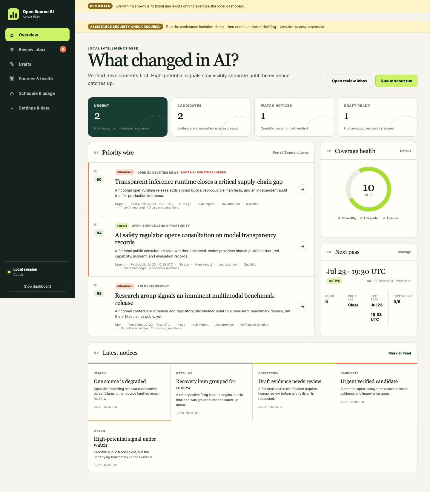
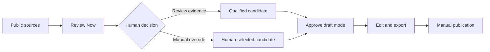

# Open Source AI News Wire

Open Source AI News Wire is a local application for monitoring and reviewing public AI news. It collects public, no-login sources, groups related reports, ranks current review work, and helps a human turn selected stories into source-linked drafts.

It covers open-source and open-weight AI, AGI developments, policy, safety, research, and broader AI news. Reporting is neutral by default. A separate open-source lens is available when the reviewer explicitly chooses it.

The application never publishes automatically.



## What the product includes

- **Public-source monitoring:** scheduled and on-demand collection from dated public sources.
- **Local review dashboard:** fresh stories, evidence state, source roles, priority, and editorial decisions in one interface.
- **macOS scheduling and recovery:** scans at minute `00` and `30` while the Mac is awake, plus recovery after missed time.
- **Optional ChatGPT drafting:** human-approved neutral or open-source-lens drafts, with an editable local fallback when assistance is unavailable.

The normal workflow is:



## Quick start

Requirements:

- macOS
- Git access to this repository
- [`uv`](https://docs.astral.sh/uv/getting-started/installation/)
- ChatGPT with Codex access only if you want assisted drafting

```bash
git clone https://github.com/SyedShad/open-source-ai-news-wire.git
cd open-source-ai-news-wire
uv python install 3.12.13
uv sync --locked
uv run open-source-ai-news-wire migrate
uv run open-source-ai-news-wire dashboard
```

The dashboard opens on a loopback-only address on your Mac. Use the one-time access link printed by the command if the browser does not open automatically.

To install the half-hour macOS schedule from this checkout:

```bash
uv run open-source-ai-news-wire schedule install \
  --launcher "$PWD/.venv/bin/open-source-ai-news-wire"
uv run open-source-ai-news-wire schedule status
```

See [Getting started](docs/guide/getting-started.md) for the full setup and first review.

## User guide

| Guide | Use it for |
|---|---|
| [Product guide](docs/guide/index.md) | Understand the product, its parts, and its boundaries |
| [Getting started](docs/guide/getting-started.md) | Install, launch, schedule, and verify the application |
| [Features and use cases](docs/guide/features-and-use-cases.md) | See every user-visible capability and when to use it |
| [Everyday workflows](docs/guide/everyday-workflows.md) | Review, verify, approve, draft, revise, and export |
| [Releases](docs/guide/releases.md) | Check the current version, update, and review release history |

## Current release

The current application release is [v0.3.7](https://github.com/SyedShad/open-source-ai-news-wire/releases/tag/v0.3.7) with database schema 7. It restores optional ChatGPT drafting behind a release-bound local check and preserves a deterministic editable draft when assistance cannot run.

See the [release guide](docs/guide/releases.md) and [changelog](CHANGELOG.md) for details.

## Important limits

- Collection runs on a schedule; it is not a guaranteed real-time wire service.
- Sources must be public and usable without accounts, cookies, payment, or access bypasses.
- Scheduled work runs while the Mac is awake. A locked screen is fine; sleep pauses work.
- Popularity and source breadth can raise attention but do not verify a claim.
- ChatGPT assistance is optional and can remain unavailable if its local checks fail.
- A human must approve every draft and publish it manually.
- Runtime data stays local and has no built-in backup in V1.

## Maintainer references

Everyday users should start with the guides above. Maintainer details remain in the [local operator guide](docs/operator-guide.md), [source validation register](docs/source-registry-validation.md), and [security threat model](docs/security-threat-model.md).

## License

MIT. Existing upstream attribution is preserved in repository history and license notices. Inherited Last30Days components remain only where they are deliberately retained and tested.
