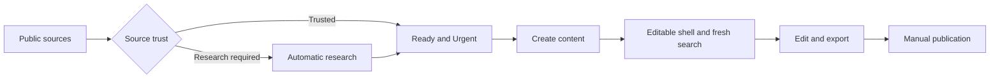

# Open Source AI News Wire

Open Source AI News Wire is a local application for monitoring public AI news and preparing source-linked Reddit content. It collects public, no-login sources, groups related reports, classifies source trust, runs automatic research when needed, and keeps final review and publication manual.

It covers open-source and open-weight AI, AGI developments, and broader AI news specifically related to privacy, security, and regulation.

The application never publishes automatically.

The owner-only online dashboard lives in [`hosted-dashboard`](hosted-dashboard/README.md).
Its interface is hosted on ChatGPT Sites while the SQLite corpus, collection,
research, drafting, and canonical mutations remain on the laptop. The laptop
makes only signed outbound HTTPS requests and accepts no inbound internet
connection.


## What the product includes

- **Public-source monitoring:** scheduled and on-demand collection from dated public sources.
- **Local review dashboard:** Ready, Researching, and Content-ready stories with trust, provenance, priority, and audit history.
- **macOS scheduling and recovery:** scans at minute `00` and `30` while the Mac is awake, plus recovery after missed time.
- **Optional ChatGPT search and drafting:** a fresh secured source search followed by packet-only Reddit writing, with an immediate editable local shell.

The normal workflow is:



## Quick start

Requirements:

- macOS
- Git access to this repository
- [`uv`](https://docs.astral.sh/uv/getting-started/installation/)
- ChatGPT with Codex access only if you want assisted drafting

```bash
git clone https://github.com/SyedShad/open-source-ai-news-wire.git
cd open-source-ai-news-wire
uv python install 3.12.13
uv sync --locked
uv run open-source-ai-news-wire migrate
uv run open-source-ai-news-wire dashboard
```

The dashboard opens on a loopback-only address on your Mac. Use the one-time access link printed by the command if the browser does not open automatically.

To install the half-hour macOS schedule from this checkout:

```bash
uv run open-source-ai-news-wire schedule install \
  --launcher "$PWD/.venv/bin/open-source-ai-news-wire"
uv run open-source-ai-news-wire schedule status
```

See [Getting started](docs/guide/getting-started.md) for the full setup and first review.

## User guide

| Guide | Use it for |
|---|---|
| [Product guide](docs/guide/index.md) | Understand the product, its parts, and its boundaries |
| [Getting started](docs/guide/getting-started.md) | Install, launch, schedule, and verify the application |
| [Features and use cases](docs/guide/features-and-use-cases.md) | See every user-visible capability and when to use it |
| [Everyday workflows](docs/guide/everyday-workflows.md) | Review trust and research, create content, revise, and export |
| [Releases](docs/guide/releases.md) | Check the current version, update, and review release history |

## Current release

The current application release is v0.4.1 with database schema 8. It adds the
verified outbound hosted-dashboard bridge and owner-only remote operations to
the v0.4 trust-and-status workflow while keeping final publishing manual.

See the [release guide](docs/guide/releases.md) and [changelog](CHANGELOG.md) for details.

## Important limits

- Collection runs on a schedule; it is not a guaranteed real-time wire service.
- Sources must be public and usable without accounts, cookies, payment, or access bypasses.
- Scheduled work runs while the Mac is awake. A locked screen is fine; sleep pauses work.
- Broader AI News is limited to privacy, security, and regulation; Open Ecosystem and AGI coverage remain separate.
- ChatGPT assistance is optional and can remain unavailable if its local checks fail.
- A human starts content creation with one button, reviews the editable result, and publishes it manually.
- Canonical runtime data stays local and has no built-in backup. The hosted
  dashboard retains a redacted read projection, short-lived requested details,
  authentication state, and expiring relay queues.

## Maintainer references

Everyday users should start with the guides above. Maintainer details remain in the [local operator guide](docs/operator-guide.md), [source validation register](docs/source-registry-validation.md), and [security threat model](docs/security-threat-model.md).

## License

MIT. Existing upstream attribution is preserved in repository history and license notices. Inherited Last30Days components remain only where they are deliberately retained and tested.
