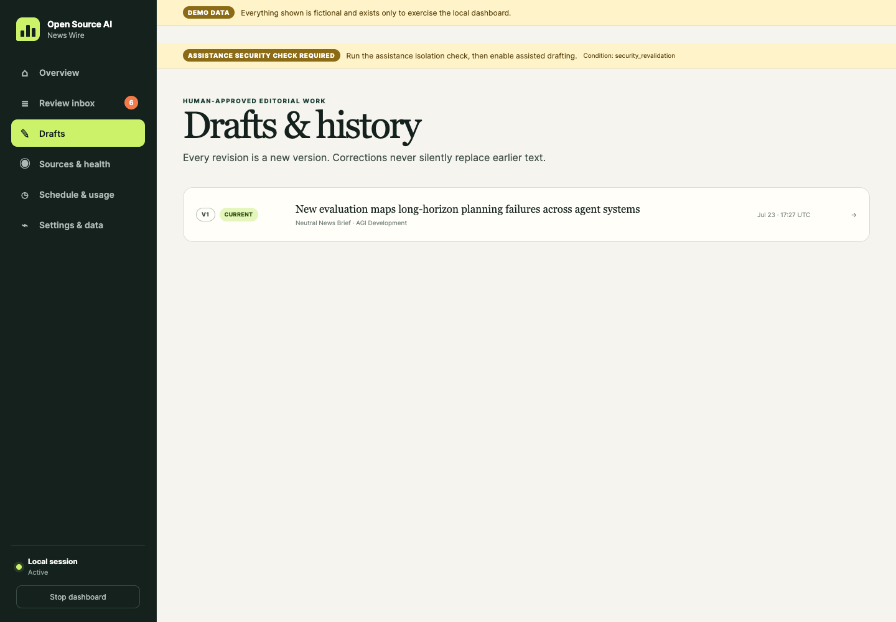

# Everyday workflows

This guide covers the normal path from a new story to an edited export. It also explains when to use the manual override, older context, recovery, and source-health controls.

## Start a review session

```bash
uv run open-source-ai-news-wire dashboard
```

Open **Review inbox** from the sidebar. The default queue is **Review Now · 24 hours** sorted by review priority.

Use the queue controls according to the task:

- Keep **Review priority** to review the best current combination of impact, evidence, momentum, and freshness.
- Select **Newest first** to inspect the latest ranking anchors regardless of score.
- Select **Older Context** for stories outside the live 24-hour window.
- Select **All History** only for retrospective or audit work.
- Use the lane, state, and queue-type filters to narrow the list.

Opening a story never approves it or creates a draft.

## Review a story

On the story page, check these sections in order:

1. **Header:** freshness, review score, impact, attention, and evidence state.
2. **Cluster timeline:** original publication, local detection, and any genuine material update.
3. **Claim ledger:** the atomic claims and their current verification state.
4. **Sources by role:** Event, Reporting, and Discovery sources kept separate.
5. **Evidence and qualification:** what has passed, what is locked, and what the reviewer can confirm.
6. **Draft approval:** normal or manual drafting actions.

Do not use attention as a substitute for evidence. A story may be important and popular while still needing source review.

## Verify and qualify a story normally

Use this path when you can establish one first-party Event source or two independent original Reporting publications.

### 1. Inspect a source

Choose **Inspect linked source**, **Inspect discovery lead**, or enter another public HTTPS URL and choose **Inspect source**.

Inspection is queued. Wait for the next worker pass or use **Run now** on Schedule and usage. A successful fetch appears as a proposal that still needs human confirmation.

### 2. Confirm its role

For a fetched proposal:

- Choose **Event / first-party source** only when the page is first-party for the event.
- Choose **Reporting source** for journalism or analysis that reports the development.
- Keep **Discovery source** when the page is primarily a lead, aggregator, or public post.

For Event evidence, confirm first-party status. For Reporting evidence, confirm or correct:

- the original reporting publication;
- whether the hosted page is original, syndicated, or citing another publication; and
- the original article URL when it is publicly available.

Suggestions do not affect qualification until a human confirms them.

### 3. Map the source to claims

Choose one relationship for each relevant claim:

- **Directly supports the claim** when the page establishes it.
- **Reports or attributes the claim** when the page establishes that someone made the claim without independently proving it.
- **Contradicts the claim** when the evidence conflicts with it.
- **Context only** when it helps explain the story without proving the claim.

Use no relationship for claims the source does not address.

### 4. Qualify the candidate

After the evidence gate passes, choose **Qualify as candidate**.

If automated importance did not pass, enter a reason for the human importance override. This leaves the automated score unchanged.

Qualification does not create a draft. It only unlocks the separate drafting decision.

## Select a story manually

Use the manual path when the story is editorially useful but normal evidence, importance, or lens eligibility remains locked.

1. Review every available claim and stored source.
2. In Draft approval, choose **Manually approve and create neutral draft** or **Manually approve and create open-source lens draft**.
3. Read the native browser warning.
4. Choose **OK** only if you intend to create the draft from the currently stored material.

No written reason is required. The action records the current gate snapshot and dispatches the draft immediately.

Manual selection does not:

- verify the story;
- change an automated gate to passed;
- promote a Discovery source to qualifying evidence; or
- insert warning language into the draft or exports.

The manual path remains unavailable for archived, withdrawn, claim-less, or source-less stories.

## Choose a drafting mode

### Neutral draft

Choose a Neutral News Brief when the goal is a compact, facts-first report. This is the default mode.

### Open-source lens draft

Choose an Open-Source Lens Brief when a concrete open-source interpretation is useful. The lens remains separate from the factual report and should include a limitation or counterargument.

The normal path requires a Strong or Moderate opportunity. The warned manual path can override that eligibility decision.

You can add optional guidance before approval, such as:

- keep the distinction between an announced policy and a final rule;
- preserve the uncertainty around a reported capability; or
- focus the lens on auditability rather than access.

Guidance cannot add facts or URLs that are absent from the approved story and source snapshot.

## Wait for or recover draft generation

Approval begins generation immediately. If the approving story tab remains open, it polls while work is active and opens the editor when the draft is ready.

If you leave the tab, open **Drafts** and review the visible request state:

| State | Meaning | Normal action |
|---|---|---|
| Starting or Generating | The committed request is active | Wait for completion |
| Waiting | A temporary prerequisite is unavailable | Follow the displayed condition or use the editable shell |
| Retrying | The one automatic transient retry is active | Wait for the retry |
| Failed | The failure needs a human action | Read the safe reason and choose Retry when available |
| Needs reapproval | Claims or approved sources changed | Return to the story and approve again |
| Draft ready | A versioned draft exists | Open Review draft |

If assisted drafting cannot run, the application creates an editable shell from the approved snapshot. Saving the shell makes it the completed manual draft and cancels pending assisted work.

## Edit, revise, and export



Open a draft from **Drafts & history**.

1. Review the headline, metadata, and factual brief.
2. Check natural source attribution and the first-use Markdown links.
3. If this is a lens brief, review the labelled lens and its limitation.
4. Compare the content with the evidence snapshot and correction state.
5. Choose **Save as version N** to preserve the current version and create a revision.
6. Use **Copy brief**, **Export Markdown**, or **Export HTML** when the content is ready.

Exports are destination-neutral. Markdown uses portable links, and HTML renders only validated links from the approved source packet.

Publication is a separate manual action outside the application.

## Respond to a correction or material change

A claim or approved source-passage change can invalidate a pending approval or mark a draft as needing review.

When that happens:

1. Return to the story.
2. Review the changed claim or source.
3. Confirm or exclude updated evidence as needed.
4. Requalify if the effective evidence gate no longer passes.
5. Approve a new draft request explicitly.

Older draft versions and the original decision history remain preserved.

Routine engagement, parser metadata, formatting, and duplicate mentions do not require reapproval and do not refresh the material-update clock.

## Check source health

Open **Sources & health** or run:

```bash
uv run open-source-ai-news-wire sources health
```

Use the page to distinguish:

- an individual degraded source;
- a locally disabled source;
- a public endpoint that is currently unavailable under the product rules; and
- a whole-Mac network outage.

Disable or enable a source only when you intend to change local collection:

```bash
uv run open-source-ai-news-wire sources disable SOURCE_ID
uv run open-source-ai-news-wire sources enable SOURCE_ID
```

Existing stories and source history remain in the corpus.

## Run now, pause, or resume

Use **Schedule & usage** or the equivalent commands:

```bash
uv run open-source-ai-news-wire schedule run-now
uv run open-source-ai-news-wire schedule pause
uv run open-source-ai-news-wire schedule resume
uv run open-source-ai-news-wire schedule status
```

Run now queues one bounded scan. Overlapping triggers are combined instead of running parallel collectors.

Pause stops future scheduled triggers. Resume returns to the normal `:00` and `:30` cadence.

## Recover an older interval

Automatic recovery covers up to 72 hours. For an older interval, use the Extended catch-up form or run:

```bash
uv run open-source-ai-news-wire catch-up \
  --start 2026-07-01 \
  --end 2026-07-07
```

The dates are inclusive. Catch-up uses the same relevance and evidence rules and never rewrites an old publication time as fresh.

## Archive a story

Choose **Archive** when a story no longer needs active review. Archiving removes it from current work but preserves its sources, claims, evidence, and decision history.

Archiving does not delete runtime data.

## End the dashboard session

Choose **Stop dashboard** in the sidebar. This ends only the on-demand web interface.

The scheduler, local database, source state, and drafts remain unchanged.
