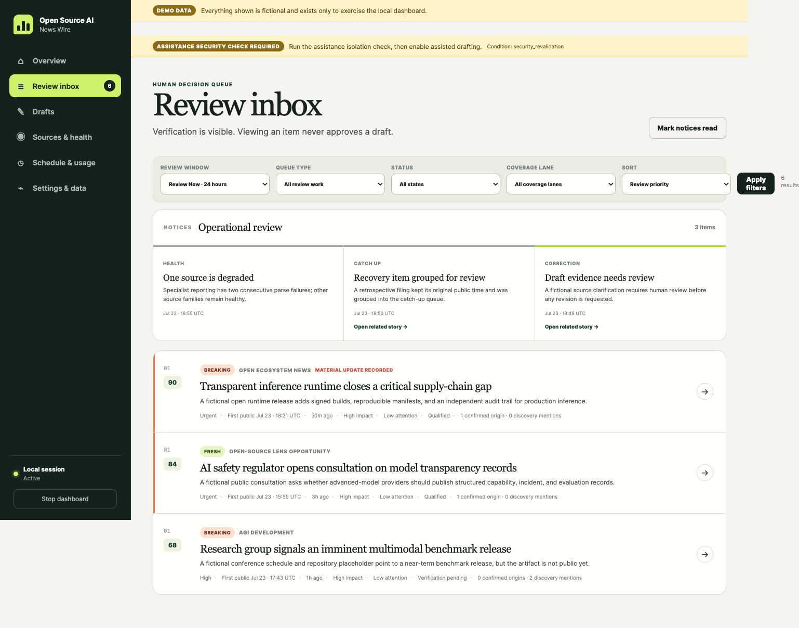
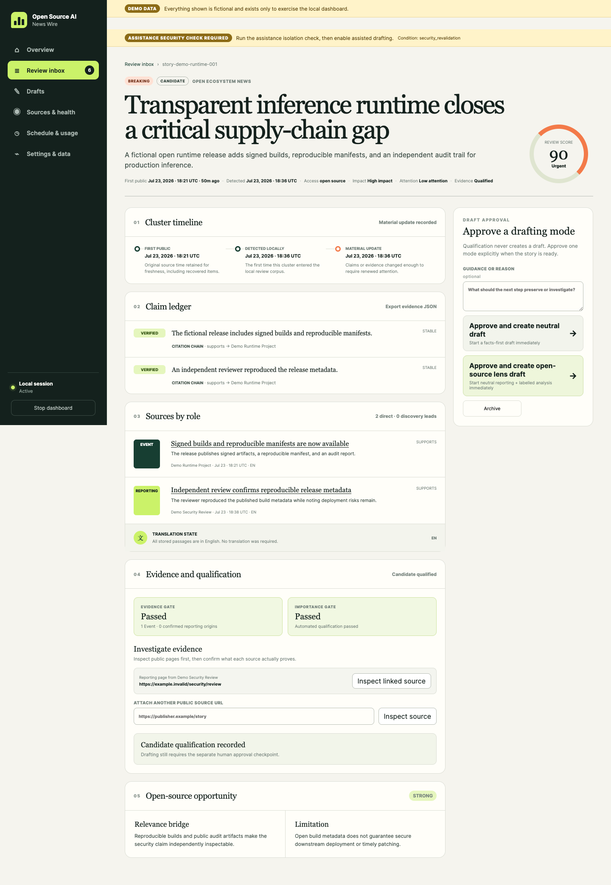
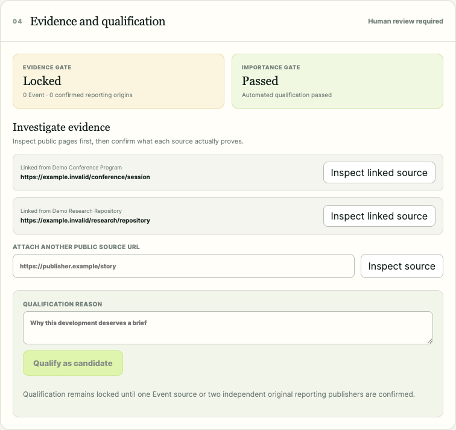
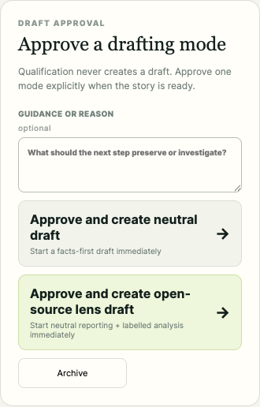
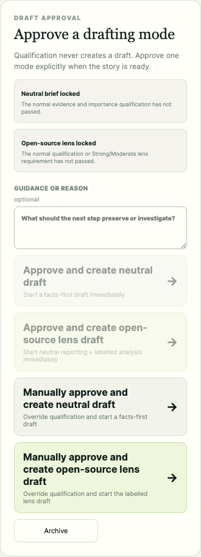
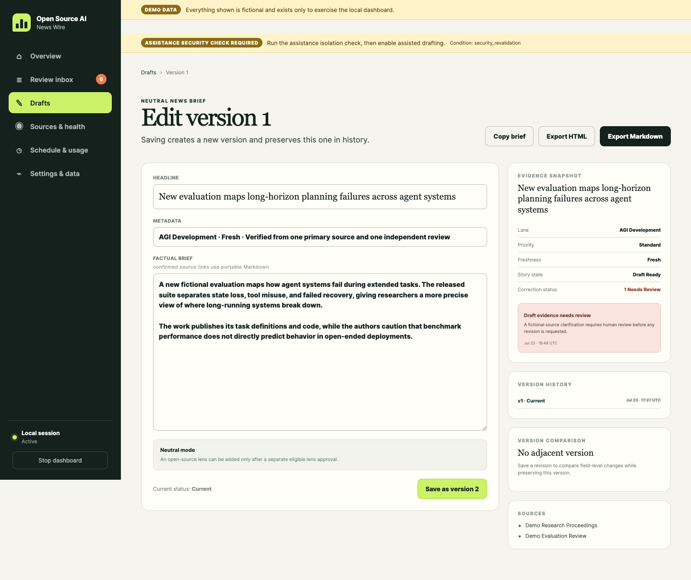
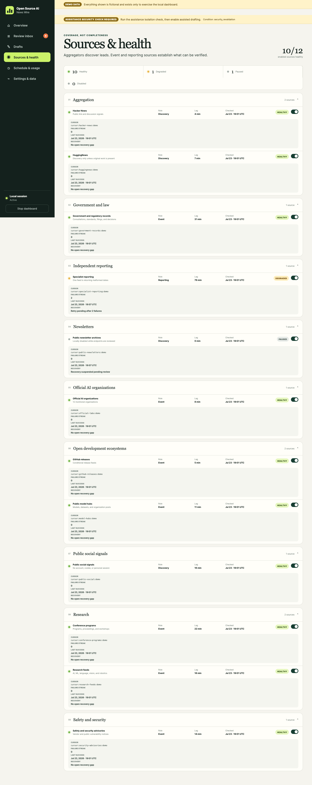
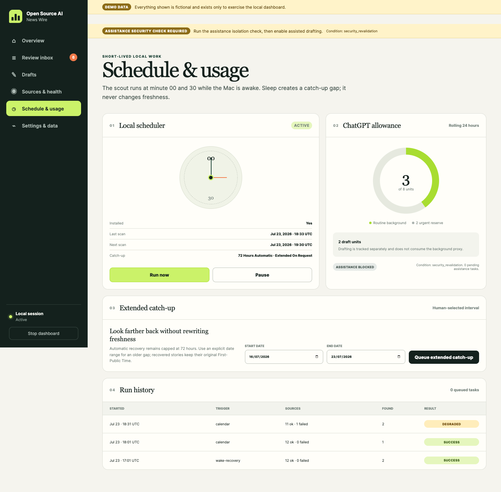
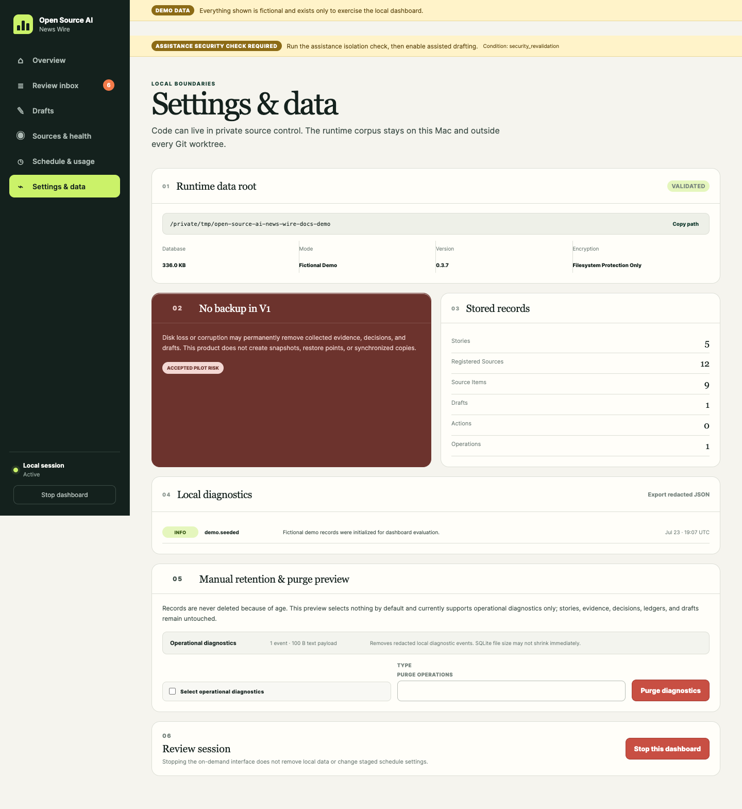

# Features and use cases

This page lists the user-visible capabilities in release 0.3.7 and explains when each one is useful.

## Coverage

The application uses three editorial lanes:

| Lane | What belongs there |
|---|---|
| Open Ecosystem News | Open-source, open-weight, source-available, open-governance, model-hub, and open development news |
| AGI Development | Research, evaluations, capabilities, safety work, and public claims related to artificial general intelligence |
| Broader AI News | Proprietary labs, products, policy, regulation, safety, security, corporate activity, and other relevant AI news |

A fourth filter, **Open-Source Lens Opportunity**, surfaces broader developments that may support a specific open-source analysis. It does not turn the underlying news report into advocacy.

## Freshness and review priority

Freshness is recalculated from the current time. It is not permanently attached when a story is first collected.

| State | Meaning |
|---|---|
| Breaking | First published within the last 2 hours |
| Fresh | First published more than 2 hours and no more than 24 hours ago |
| Updated | An older story with a genuine material claim change in the last 24 hours |
| Newly surfaced | Recently discovered, but the original publication date is unknown |
| Older | More than 24 hours old with no current material update |

Newly surfaced and Older stories receive no freshness points and cannot retain a current Breaking or Fresh label.

The live review score combines four separate signals:

- durable importance;
- confirmed evidence strength;
- current momentum from distinct sources or accounts and engagement velocity; and
- freshness.

The dashboard shows the resulting review priority alongside impact, attention, and verification. Momentum can move an item higher for review but cannot verify a claim.

## Overview and Review inbox

*The Review Now queue keeps current unresolved work visible. Operational notices remain separate from stories.*

### Overview

The Overview provides:

- counts for urgent stories, candidates, watches, and ready drafts;
- the current Priority Wire;
- enabled-source health;
- the next scheduled pass and queue state; and
- recent editorial and operational notices.

### Review inbox

The default view is **Review Now · 24 hours**. It includes unresolved signals, watches, and candidates anchored by a current publication or material-update time.

Available controls:

- **Review priority:** highest current review score first.
- **Newest first:** most recent ranking anchor first.
- **Older Context:** historical material outside the live window.
- **All History:** explicit audit and retrospective review.
- Filters for queue type, state, and coverage lane.
- Stable pages of up to 25 stories.

Approved, draft-ready, archived, withdrawn, completed, and expired-watch stories do not remain in the default live queue.

## Story review

Each story page combines:

- original publication, local detection, and material-update times;
- one normalized claim ledger;
- source passages grouped by role;
- discovery leads that still need inspection;
- evidence and importance gates;
- a separately labelled open-source opportunity, when present;
- draft approval controls; and
- a short decision history.

Routine rescans, formatting changes, engagement counters, and source metadata do not create a material update. Only a changed normalized claim set can return an older story to Review Now as Updated.

## Evidence and qualification

The evidence workbench lets the reviewer:

- inspect a linked public page;
- attach another public HTTPS URL;
- confirm Event, Reporting, or Discovery role;
- map the source to specific claims;
- record whether the source supports, reports, contradicts, or contextualizes each claim;
- confirm or correct an original Reporting publisher and provenance; and
- exclude evidence without deleting its audit history.

One confirmed Event source or two independent confirmed original Reporting publications pass the normal evidence gate. Syndication and repeated citations of the same original report count once.

An official page proves that the announcement was made. Promotional capability, performance, safety, or comparison claims remain attributed unless the evidence directly establishes them.

## Watches and candidates

- **Signal:** collected material that still needs review.
- **Watch:** a current, high-potential Discovery story that has not passed verification.
- **Candidate:** a story ready for a separate drafting decision.

Candidate status can come from normal evidence qualification or from a warned human override. The dashboard retains the basis so manual selection is never presented as verification.

## Draft approval

### Normal approval

After candidate qualification, the reviewer chooses one mode:

- **Approve and create neutral draft** for a facts-first brief.
- **Approve and create open-source lens draft** for neutral reporting plus a separately labelled analysis section.

The normal lens option is available only for a Strong or Moderate open-source opportunity.

### Manual approval

When normal controls are locked, the reviewer may choose **Manually approve and create**. A native browser confirmation warns that qualification requirements have not passed.

Manual approval can override evidence, importance, and lens eligibility, but it does not change those automated results. The override remains visible in the dashboard and audit history only. It is not inserted into copied or exported content.

## Draft generation and editing

Approval dispatches the draft immediately. The durable queue remains available for retry and recovery.

Visible states include Starting, Generating, Waiting, Retrying, Failed, Needs reapproval, and Draft ready. A claim or approved-source change invalidates the approval snapshot before another assisted generation can run.

When ChatGPT assistance is unavailable, approval creates an editable source-bound shell. Saving that shell completes a manual draft and cancels its pending AI work.

Draft content uses:

- a factual headline;
- compact lane and freshness metadata;
- two concise evidence-led paragraphs;
- natural publication attribution;
- portable Markdown links validated against the approved sources; and
- a grouped Sources section.

Discovery material can appear as proof only on the warned manual path and only when its stored URL is safe. It remains Discovery evidence internally.

## Draft history, revisions, and exports

The Drafts area provides:

- queued, generating, waiting, failed, reapproval, and completed requests;
- immutable earlier versions;
- a new version on every save;
- field-level comparison with an adjacent version;
- correction notices tied to the evidence snapshot;
- Copy brief;
- Markdown export; and
- sanitized HTML export.

Exported content does not include internal gate names, manual-override warnings, or provisional system labels. Publication happens outside the application and is always manual.

## Sources and health

Sources are grouped by family and show role, last check, lag, cursor, failure streak, recovery state, and local enablement.

The application distinguishes:

- healthy and degraded enabled sources;
- locally paused or disabled sources;
- sources that were implemented but cannot currently pass public-access validation; and
- sources excluded by operator choice.

Disabling a source does not delete stories already collected from it.

## Schedule, recovery, and usage

The Schedule and usage page provides:

- install, run-now, pause, resume, and uninstall controls;
- last and next scan times;
- 72-hour automatic recovery status;
- ChatGPT background and draft allowance summaries;
- a human-selected extended catch-up interval; and
- scan history and result state.

An offline whole-Mac scan is grouped as one outage instead of creating a separate failure for every source. Source cursors and failure streaks do not advance during that outage.

## Notifications

Native notifications are optional and disabled by default during shadow validation. Dashboard notices remain available.

Activation is all-or-nothing. It requires current database and scheduler health, healthy enabled sources after the validation epoch, a safe queue and disk state, a successful canary, and no critical diagnostic or alert storm. Historical alerts before the activation watermark are never delivered as native notifications.

Notifications never approve a draft or publish content.

## Local data controls

Settings and data shows:

- the local runtime root and application version;
- stored record counts;
- redacted diagnostics export;
- manual retention controls; and
- the active dashboard session.

Records are not deleted because of age. Purge is preview-first and has no undo because V1 has no backup feature.

## Expected use cases

| Use case | Recommended path |
|---|---|
| Review fresh AI developments each day | Open Review Now and keep Review priority sorting |
| See the newest collected material regardless of score | Select Newest first |
| Review a popular but unverified story | Treat attention as a review signal, then inspect evidence |
| Verify an official release or filing | Confirm the first-party page as Event evidence and map its claims |
| Verify a reported policy development | Confirm two independent original Reporting publications |
| Cover a useful story before evidence qualification | Use the warned manual approval path and review every attribution |
| Prepare a neutral news post | Approve a Neutral News Brief, edit it, and export Markdown or HTML |
| Add an open-source interpretation | Approve the labelled lens mode and retain a concrete limitation |
| Review older material | Use Older Context or All History, not Review Now |
| Recover missed awake or offline time | Let 72-hour recovery run, or choose an explicit older interval |
| Maintain a private editorial record | Keep the runtime root local and export only selected drafts manually |

## Product boundaries

- The application is not a guaranteed real-time alerting service.
- It does not use private social accounts, cookies, paid source access, or paywall bypasses.
- It does not treat engagement as truth.
- It does not draft without human approval.
- It does not publish automatically.
- It does not back up or synchronize the runtime corpus.
